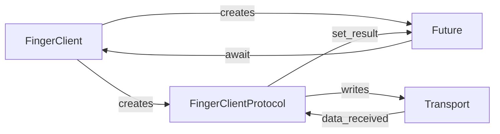
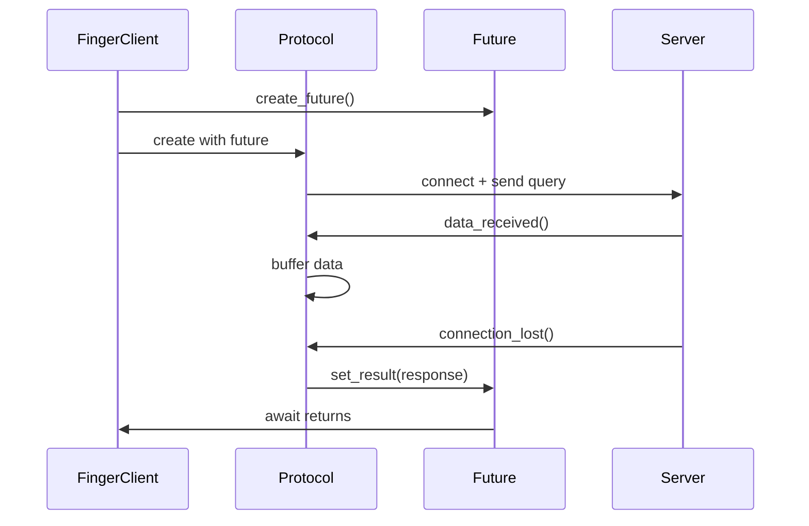

# Architecture

How Mapilli is designed and implemented.

## Overview

Mapilli follows the architecture patterns established in [Nauyaca](https://github.com/alanbato/nauyaca), a modern Gemini protocol implementation. It uses asyncio's Protocol/Transport pattern for efficient networking.

## Package Structure

```
mapilli/
├── __init__.py           # Public API exports
├── __main__.py           # CLI entry point
├── protocol/             # Protocol types
│   ├── constants.py      # Protocol constants
│   ├── request.py        # FingerRequest
│   └── response.py       # FingerResponse
├── client/               # Client implementation
│   ├── protocol.py       # FingerClientProtocol
│   └── session.py        # FingerClient
└── utils/                # Utilities
    └── logging.py        # Structured logging
```

## Protocol/Transport Pattern

Mapilli uses asyncio's low-level Protocol/Transport pattern instead of the higher-level StreamReader/StreamWriter:



### Why Protocol/Transport?

1. **Lower overhead**: No async/await context switching for each read/write
2. **Better for simple protocols**: Finger is request-response, no streaming needed
3. **Efficient buffering**: We control exactly how data is accumulated
4. **Natural flow**: Connection lifecycle maps cleanly to protocol methods

## Key Components

### FingerClientProtocol

The low-level protocol handler:

```python
class FingerClientProtocol(asyncio.Protocol):
    def connection_made(self, transport):
        # Send query immediately
        transport.write(f"{self.query}\r\n".encode("ascii"))

    def data_received(self, data):
        # Buffer incoming data
        self.buffer += data

    def connection_lost(self, exc):
        # Create response and resolve Future
        response = FingerResponse(body=self.buffer.decode(), ...)
        self.response_future.set_result(response)
```

### FingerClient

The high-level async API:

```python
class FingerClient:
    async def finger(self, host, query):
        loop = asyncio.get_running_loop()
        response_future = loop.create_future()

        # Create connection with protocol
        transport, protocol = await loop.create_connection(
            lambda: FingerClientProtocol(query, host, port, response_future),
            host=host,
            port=port,
        )

        # Wait for response via Future
        return await response_future
```

### Bridging Callbacks to Async/Await

The key insight is using `asyncio.Future` to bridge:

1. **Create Future**: Before connecting
2. **Pass to Protocol**: Protocol stores reference to Future
3. **Resolve in callback**: `connection_lost()` sets the result
4. **Await in caller**: High-level code awaits the Future



## Query Parsing

The `FingerRequest` class handles RFC 1288 query parsing:

```python
request = FingerRequest.parse("alice@example.com")
# request.username = "alice"
# request.hostname = "example.com"
# request.query_type = QueryType.USER_REMOTE

request = FingerRequest.parse("/W alice")
# request.username = "alice"
# request.verbose = True
```

## Error Handling

Errors are propagated through the Future:

1. **Connection errors**: Caught in `create_connection()`, raised as `ConnectionError`
2. **Timeouts**: `asyncio.wait_for()` raises `TimeoutError`
3. **Protocol errors**: Set as exception on Future via `set_exception()`

## Type Safety

Mapilli uses full type annotations:

- All public APIs have type hints
- `py.typed` marker for PEP 561
- Verified with [ty](https://github.com/astral-sh/ty) type checker

## See Also

- [Finger Protocol](finger-protocol.md) - Protocol specification
- [API Reference](../reference/api/index.md) - Complete API docs
