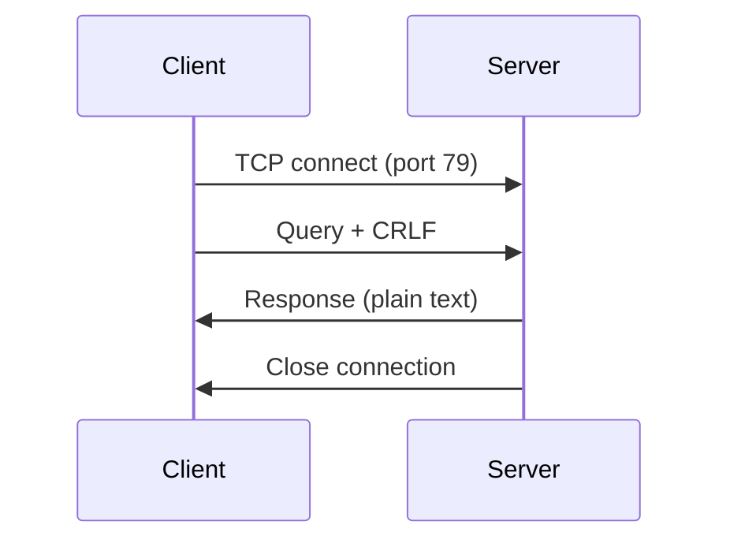

# The Finger Protocol

The Finger protocol is defined in [RFC 1288](https://www.rfc-editor.org/rfc/rfc1288.html) (December 1991).

## Overview

Finger is a simple protocol for querying user information on remote systems. It was designed in an era when multi-user systems were common and users wanted to know who was logged in or get information about other users.

## How It Works



1. **Connect**: Client opens TCP connection to port 79
2. **Query**: Client sends query string followed by CRLF (`\r\n`)
3. **Response**: Server sends plain text response
4. **Close**: Server closes the connection

## Query Format

The query format is defined by this grammar:

```
{Q1} ::= [{W}|{W}{S}{U}]{C}
{Q2} ::= [{W}{S}][{U}]{H}{C}
{U}  ::= username
{H}  ::= @hostname | @hostname{H}
{W}  ::= /W
{S}  ::= <SP> | <SP>{S}
{C}  ::= <CRLF>
```

### Query Types

| Query | Meaning |
|-------|---------|
| `\r\n` | List all users |
| `alice\r\n` | Info about user "alice" |
| `/W alice\r\n` | Verbose info about "alice" |
| `@remote\r\n` | Forward query to remote host |
| `alice@remote\r\n` | Query "alice" at remote host |

## Response Format

Responses are plain ASCII text. The format is not strictly defined—servers can return any text they want. Common formats include:

```
Login: alice
Name: Alice Smith
Directory: /home/alice
Shell: /bin/bash
Last login: Mon Dec 30 10:00 on pts/0
No Plan.
```

## The `/W` Switch

The `/W` prefix requests verbose ("Whois-style") output. This typically includes more detailed information about the user.

## Query Forwarding

The `@host` syntax enables query forwarding. When a server receives `alice@remote`, it should:

1. Connect to `remote` on port 79
2. Send `alice\r\n`
3. Return the response to the original client

This allows chained queries like `alice@host1@host2`.

!!! warning "Security Consideration"
    Query forwarding can be a security concern. Many modern servers disable this feature.

## Security

The Finger protocol has no built-in security:

- **No encryption**: All data is sent in plain text
- **No authentication**: Anyone can query
- **Information disclosure**: Reveals usernames and activity

For these reasons, many organizations disable Finger servers or restrict access.

## Modern Usage

While Finger is largely obsolete for its original purpose, it's still used in some contexts:

- **Retro computing**: For nostalgia and education
- **Status pages**: Simple status information
- **Tilde communities**: User information on shared systems
- **Protocol education**: Simple example of client-server networking

## See Also

- [RFC 1288 - The Finger User Information Protocol](https://www.rfc-editor.org/rfc/rfc1288.html)
- [Architecture](architecture.md) - How Mapilli implements the protocol
